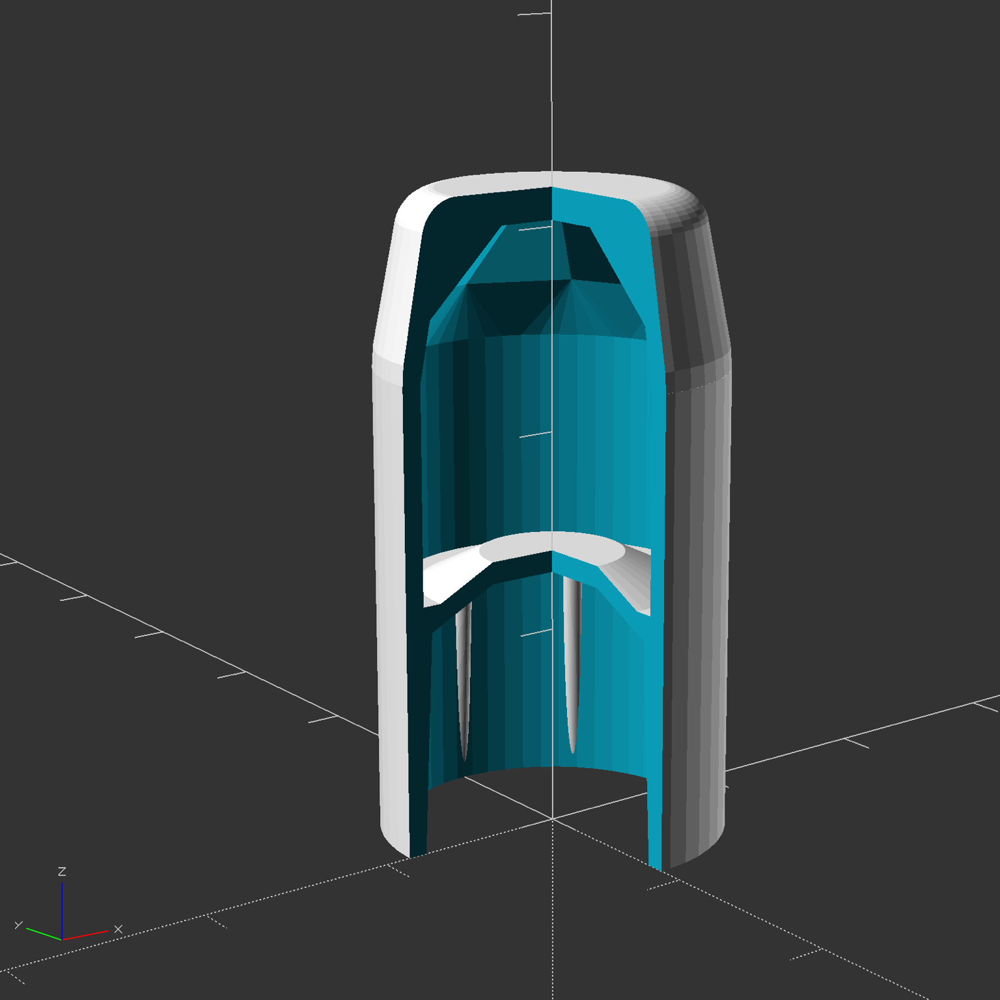

# Parametric Flashlight Diffuser

This module produces a diffuser cap for flashlights so they can be used for ambient lighting.

For obvious reasons, this works best with translucent filaments (I've been using MatterHackers' Clear Translucent Pro PLA).

## Instructions

Print test parts to dial in the proper diameter:

1. Measure the widest point at the top of your flashlight.
2. Set the `diameter` property to this value **plus** .5-1mm to
   account for thermal shrinkage.
3. Set the `diffuser_type` to `None`.
4. Set any additional configuration properties that you want.
5. Print your part and test the fit of the slip-on ring.
6. Repeat until the slip-on ring fits.

Once you have a good fit for the ring, set the `diffuser_type` value back to `Dome` and print your final product with as little infill as you can get away with (0-10% seems to work fine, depending on the diameter).

## Cross Section View

